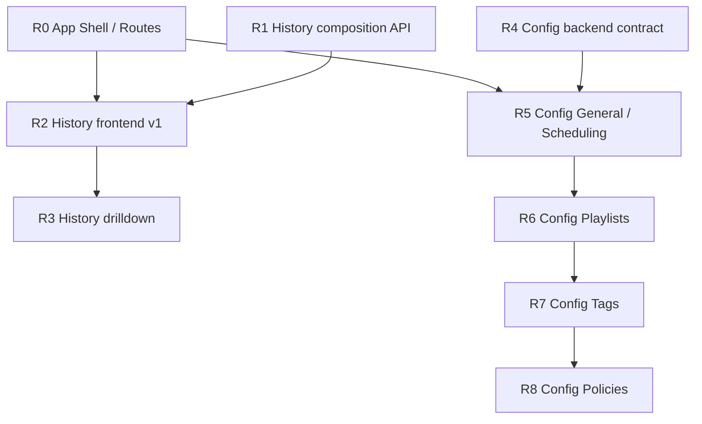

# Dashboard V2 Roadmap

本文档记录 `dashboard-v2` 在 Dashboard 完成后的下一阶段开发路线。路线基于 2026-05-04/05 的代码现状与当前协作结论编写。

目标不是列愿望清单，而是把接下来可执行的开发顺序、阶段边界、依赖关系和验收方式固定下来，避免 History 与 Config Editor 同时展开后互相牵制。

## 0. 当前状态

已完成：

- `dashboard-v2` 已经成为正式前端运行时。
- pywebview 已经加载 `dashboard-v2/dist/`。
- Dashboard analysis 后端事实源已经迁移到 `SchedulerTickTrace`。
- `GET /api/analysis/window` 已经成为新 Dashboard 的正式数据入口。
- Dashboard 页面已经具备：
  - 顶部时间轴
  - `Sense / Think / Act` 三栏
  - `live / snapshot` 双态
  - hover scrub / click lock / keyboard step
- `dashboard-v2` 已经具备 Vue 3、Vite、TypeScript、Tailwind CSS v4、Pinia、Vue Router、ECharts 与 workbench 原语。
- App Shell 与正式路由骨架已经完成：
  - `/dashboard`
  - `/history`
  - `/config/general`
  - `/config/scheduling`
  - `/config/playlists`
  - `/config/tags`
  - `/config/policies`
- `GET /api/config` 已返回 `current + defaults`。
- `POST /api/config` 已保存完整 canonical `AppConfig`。
- `PoliciesConfig` 已禁止未知 policy key。

尚未完成：

- `History` v2 页面尚未实现，`/history` 仍是 placeholder。
- `Config Editor` v2 页面尚未实现，`/config/*` 仍是 placeholder。
- Config 前端 draft store、dirty state、restore defaults 与 field error 映射尚未实现。

## 1. 总体原则

### 1.1 纵向切片优先

接下来不按“先全部后端，再全部前端”推进，而是按功能做纵向切片：

1. 先建立共享应用壳层和路由。
2. 再做 `History` 的后端正式接口与前端页面。
3. 再做 `Config` 后端契约。
4. 最后分批实现 `Config` 前端 section。

原因：

- `History` 已有后端聚合基础，能较快形成可用页面。
- `Config` 前端强依赖新后端契约；如果先做前端，会被迫在前端补默认值，违反 `CONFIG_EDITOR_SPEC.md`。
- 共享 Shell 先落地，可以避免 `Dashboard / History / Config` 三个页面重复实现导航和 chrome。

### 1.2 后端契约先于复杂前端

每个功能块都先稳定 API contract，再做正式页面。

特别是 `Config`：

- 不允许前端继续围绕裸 JSON 建完整编辑器。
- 不允许前端自行发明默认值。
- 不允许为了快速出 UI 继续保留未知 policy key 的长期兼容路径。

### 1.3 一次只保留一个正式模型

项目仍处于 `0.x`，允许 breaking change。

迁移时应避免长期双轨：

- `History` 主模型转向 `composition` 后，`segments` 不再作为主视图模型。
- `Config` 返回 `current + defaults` 后，前端不再依赖裸 `AppConfig` 响应。
- 旧 composable 可以短期辅助迁移，但不应成为新页面长期状态层。

### 1.4 最小可验收阶段

每个阶段都必须能独立通过基本验证，而不是把风险推迟到最后：

- 改后端 API：至少跑相关 pytest，能跑全量时跑 `pytest -q`。
- 改 `dashboard-v2`：至少跑 `npm run type-check`。
- 涉及路由、页面结构、图表或打包产物：再跑 `npm run build-only`。

## 2. 推荐开发路线

总路线：

```text
R0 App Shell / Routes
  -> R1 History backend composition API
  -> R2 History frontend v1
  -> R3 History drilldown and polish
  -> R4 Config backend contract
  -> R5 Config General / Scheduling
  -> R6 Config Playlists
  -> R7 Config Tags
  -> R8 Config Policies
```

## 3. 阶段规划

### R0 - App Shell 与路由骨架 - [DONE]

目标：

- 把当前 `DashboardView.vue` 中的应用壳层抽到共享层。
- 建立正式路由模型，给 `History` 与 `Config` 留出稳定入口。

建议改动：

- 新增 `dashboard-v2/src/layouts/AppShell.vue` 或等价布局组件。
- `DashboardView.vue` 只保留 Dashboard 页面主体，不再拥有全局 Sidebar。
- `router/index.ts` 引入：
  - `/dashboard`
  - `/history`
  - `/config/general`
  - `/config/scheduling`
  - `/config/playlists`
  - `/config/tags`
  - `/config/policies`
  - `/` redirect 到 `/dashboard`
- `WorkbenchSidebar` 支持：
  - 一级导航：Dashboard / History / Config
  - Config 二级导航：General / Scheduling / Playlists / Tags / Policies

难度：中。

任务量：小到中。

主要风险：

- Sidebar 当前只有单页面用法，抽出后要保证 Dashboard 的 live polling 生命周期仍然只由 Dashboard 页面自己管理。
- Config 二级导航需要一开始就按 spec 建模，避免之后重做 Sidebar。

验收标准：

- Dashboard 原有功能不退化。
- 刷新 `/dashboard`、`/history`、`/config/general` 均能由 hash router 正确恢复。
- Sidebar 能正确标记一级与二级 active 状态。

验证：

```bash
cd dashboard-v2
npm run type-check
npm run build-only
```

### R1 - History 后端 Composition API

目标：

- 将现有 `/api/history/aggregate` 的思想升级为正式 `History` 主接口。
- 建立 output-centric 的长期回顾数据契约。

建议接口：

```text
GET /api/history/composition?preset=24h
GET /api/history/composition?preset=7d
GET /api/history/composition?preset=30d
GET /api/history/composition?preset=90d
GET /api/history/composition?preset=180d
GET /api/history/composition?from=<ISO>&to=<ISO>
```

响应模型：

```ts
type HistoryBucket = {
  bucketId: string;
  start: string;
  end: string;
  playlistSeconds: Record<playlistRef, number>;
  playlistRatio: Record<playlistRef, number>;
  switchCount: number;
  cycleCount: number;
  pauseSeconds: number;
};

type HistoryCompositionResponse = {
  range: {
    from: string;
    to: string;
    preset: "24h" | "7d" | "30d" | "90d" | "180d" | string | null;
  };
  granularity: {
    bucketSeconds: number;
    label: string;
    bucketCount: number;
  };
  seriesOrder: string[];
  buckets: HistoryBucket[];
  totals: {
    playlistSeconds: Record<playlistRef, number>;
    playlistRatio: Record<playlistRef, number>;
    switchCount: number;
    cycleCount: number;
    pauseSeconds: number;
  };
};
```

建议实现：

- 在 `utils/history_logger.py` 中新增 composition 方法，或新增轻量 mapper/helper，避免让 `ui/dashboard.py` 承担聚合细节。
- 后端根据 preset 或 `from/to` 自动选择 bucket size。
- `seriesOrder` 按总时长降序，确保前端堆叠顺序稳定。
- `switchCount` 统计 `playlist_switch`。
- `cycleCount` 统计 `wallpaper_cycle`。
- `pauseSeconds` 从 pause/resume 区间计算，不简单等同于 pause 事件数量。
- 保留旧 `/api/history` 和 `/api/history/aggregate`，但新页面不依赖它们。

难度：中。

任务量：中。

主要风险：

- 长时间范围跨月读取时，要继续复用 `HistoryLogger` 的月度分片扫描能力。
- pause/resume 区间与 playlist active 区间要分开统计，避免 pause 时间被错误计入 playlist 占比。
- bucket 自动粒度需要稳定、可测试，不要让前端传 `bucket_minutes`。

验收标准：

- `preset=7d / 30d / 180d` 均能返回合理 bucket 数。
- totals 与 buckets 加总结果一致。
- 无历史数据时返回空 buckets 或零值 totals，而不是 500。
- 非法 preset、非法日期、反向时间范围返回明确 400。

验证：

```bash
pytest tests/test_history_logger.py tests/test_dashboard_api.py -q
```

### R2 - History 前端 v1

目标：

- 实现 `History` v2 首页。
- 页面主语义从 legacy event timeline 转为 playlist composition over time。

建议改动：

- 新增 `dashboard-v2/src/lib/historyComposition.ts`：
  - 定义 `HistoryBucket`
  - 定义 `HistoryCompositionResponse`
  - 封装 `fetchHistoryComposition()`
- 新增 `dashboard-v2/src/stores/historyComposition.ts`：
  - `mode`
  - `preset`
  - `customRange`
  - `response`
  - `selectedBucketId`
  - `loading`
  - `error`
  - `fetchPreset()`
  - `fetchCustomRange()`
- 新增 `dashboard-v2/src/views/HistoryView.vue`。
- 新增 `dashboard-v2/src/features/history-composition/*`：
  - range preset control
  - composition chart
  - top playlists list
  - totals summary

页面结构：

1. 顶部控制区：
   - `24h / 7d / 30d / 90d / 180d`
   - custom range 入口
   - 当前 granularity 文案
2. 主图区：
   - stacked area chart
   - bucket hover tooltip
   - bucket click 选中态
3. 辅助洞察区：
   - Top Playlists
   - Switch Count
   - Cycle Count
   - Pause Time

难度：中偏高。

任务量：中偏大。

主要风险：

- ECharts 配置要适配空数据、单 playlist、playlist 很多、bucket 很少等情况。
- tooltip 需要把 ratio 与 seconds 都解释清楚，但不要把 bucket 概念暴露成主要控制项。
- 当前 `useHistory.ts` 仍是 legacy `segments` composable，新页面不应继续沿用它。

验收标准：

- 用户能在 `7d / 30d / 180d` 中看出 playlist 占比变化。
- 主图不依赖 `segments`。
- preset 切换会重新请求 composition 接口。
- loading / empty / error 状态完整。
- 页面符合 `dashboard-v2/docs/UI_ENGINEERING_SPEC.md` 的 workbench、Pinia、Tailwind 与 token 约束。

验证：

```bash
cd dashboard-v2
npm run type-check
npm run build-only
```

### R3 - History Drilldown 与体验打磨

目标：

- 补齐 `History` 的下钻能力和短时段辅助信息。

建议改动：

- 点击 bucket 后：
  - `180d` 的周 bucket 可下钻到该周。
  - `30d` 的日 bucket 可下钻到该日或该日附近 24h。
  - `7d` 可下钻到单日。
- 顶部提供 reset view / back control。
- 保持主图仍是 composition 语义，不切换成 Gantt timeline。
- 可选增加短时段 event 辅助面板：
  - 只用于 selected bucket 或 24h 范围
  - 不作为首页主视图

难度：中。

任务量：中。

主要风险：

- drilldown 状态不要污染 router 过多；首版可留在 Pinia 内，必要时再将 range 写入 query。
- event 面板不能把页面重新拉回 legacy History 心智。

验收标准：

- 用户可以从粗范围进入更细范围。
- 主图语义在 drilldown 前后保持一致。
- reset 后可回到原 preset。

验证：

```bash
cd dashboard-v2
npm run type-check
npm run build-only
```

## 4. Config Editor 路线

Config Editor 是最大块，不应一次性完成全部 UI。路线应分成一个后端契约阶段和四个前端 section 阶段。

### R4 - Config 后端契约 - [DONE]

目标：

- 建立 Config Editor v2 的正式后端 contract。
- 消除前端补默认值的需求。
- 禁止未知 policy key。

建议改动：

- `GET /api/config` 返回：

```ts
type ConfigDocumentResponse = {
  current: AppConfig;
  defaults: AppConfig;
};
```

- `current` 必须是 normalized 完整配置。
- `defaults` 必须来自同一 schema 的默认值树。
- `POST /api/config` 继续保存完整 `AppConfig`，但校验错误应稳定返回 field errors。

难度：中。

任务量：中。

主要风险：

- Pydantic defaults 与业务必填字段之间存在张力。
- 禁止未知 policy key 会是 breaking change，需要同步测试。
- 如果 `AppConfig` 仍要求 `wallpaper_engine_path` 非空，默认树构造不能简单 `AppConfig()`。

验收标准：

- `current` 中缺失的可选节点被 schema 补齐。
- `defaults` 可用于 section restore 与 policy restore。
- 未知 policy key 保存时返回 422。
- 前端不需要自行补 policy / scheduling 默认值。

验证：

```bash
pytest tests/test_config_loader.py tests/test_dashboard_api.py -q
```

### R5 - Config General / Scheduling

实施规格：[`docs/frontend/CONFIG_EDITOR_R5_SPEC.md`](frontend/CONFIG_EDITOR_R5_SPEC.md)

目标：

- 建立 Config 前端的编辑状态模型。
- 先实现两个单例 section，验证保存、脏状态和 restore 语义。

建议改动：

- 新增 `dashboard-v2/src/lib/configDocument.ts`。
- 新增 `dashboard-v2/src/stores/configDocument.ts`。
- 新增 `dashboard-v2/src/views/ConfigView.vue`，通过子路由或 section route 渲染具体 section。
- 新增：
  - `ConfigGeneralSection.vue`
  - `ConfigSchedulingSection.vue`
- 支持：
  - load current/defaults
  - local draft
  - dirty state
  - save
  - section restore defaults
  - field error display

难度：中。

任务量：中。

主要风险：

- draft 更新不要直接原地污染 saved snapshot。
- Router 切换时的未保存变更提示要统一设计，避免每个 section 自己做一套。

验收标准：

- `/config/general` 和 `/config/scheduling` 可刷新恢复。
- 修改字段后 dirty state 正确。
- 保存成功后 dirty state 清零。
- restore defaults 用后端返回的 `defaults` 替换对应 section。

验证：

```bash
cd dashboard-v2
npm run type-check
npm run build-only
```

### R6 - Config Playlists

目标：

- 实现 `Playlists` 的 browser + detail 工作台。

建议功能：

- 左侧 Playlist Browser：
  - 搜索
  - count
  - create playlist
  - selected state
  - display name / internal name
- 右侧 Playlist Detail：
  - `name`
  - `display`
  - `color` （并附取色盘）
  - tag vector list
  - add/remove tag
  - edit tag weight
  - batch add tags
- route query 持久化选中 playlist：

```text
/config/playlists?name=BRIGHT_FLOW
```

难度：高。

任务量：中偏大。

主要风险：

- playlist `name` 是标识符，rename 会影响 query selected state 和潜在引用。
- tag vector 编辑需要防止重复 tag。
- color 编辑要符合 `#RRGGBB` schema。

验收标准：

- 用户可创建、选择、编辑、删除 playlist。
- 选中 playlist 可刷新恢复。
- tag vector 不暴露为原始 JSON 编辑。
- 保存后后端 schema 校验通过。

验证：

```bash
cd dashboard-v2
npm run type-check
npm run build-only
pytest tests/test_config_loader.py tests/test_dashboard_api.py -q
```

### R7 - Config Tags

目标：

- 实现 `Tags` 的 browser + detail 工作台。
- 将 fallback 作为边列表编辑，而不是原始 key-value JSON。

建议功能：

- 左侧 Tag Browser：
  - 搜索
  - count
  - create tag
  - 是否有 fallback
  - fallback edge count
- 右侧 Tag Detail：
  - tag identity
  - fallback targets
  - edge weight
  - add/remove fallback edge
- route query 持久化选中 tag：

```text
/config/tags?tag=%23dawn
```

难度：中偏高。

任务量：中。

主要风险：

- tag rename 会影响 playlists 中的 tag references 与 fallback graph references。
- fallback graph 要避免明显自环或重复 edge。

验收标准：

- 用户可编辑 fallback graph。
- fallback 不以原始 JSON key-value 暴露。
- rename / delete tag 的影响路径有明确交互。

验证：

```bash
cd dashboard-v2
npm run type-check
npm run build-only
pytest tests/test_config_loader.py tests/test_dashboard_api.py -q
```

### R8 - Config Policies

目标：

- 实现固定 policy 类型的顶部 selector + detail editor。

正式支持：

- `activity`
- `time`
- `season`
- `weather`

建议功能：

- 顶部 selector：
  - 横向切换
  - 当前 policy 高亮
  - query 持久化：

```text
/config/policies?policy=activity
```

- 通用 policy header：
  - enabled
  - weight_scale
  - restore policy defaults
- policy 专属字段：
  - Activity：
    - process_rules
    - title_rules
    - smoothing_window
  - Time：
    - auto
    - day_start_hour
    - night_start_hour
  - Season：
    - spring_peak
    - summer_peak
    - autumn_peak
    - winter_peak
  - Weather：
    - api_key
    - lat
    - lon
    - fetch_interval
    - request_timeout
    - warmup_timeout

难度：高。

任务量：大。

主要风险：

- Activity 的规则编辑是嵌套字典，需要设计可维护的 list editor。
- Weather API key 需要脱敏处理。考虑这是本地应用，使用 password input 或 reveal toggle 即可满足要求，避免默认明文长时间展示。

验收标准：

- 用户可编辑四个正式 policy。
- 用户可 restore 单个 policy defaults。
- 未知 policy 不会出现在 UI 中，也不能保存成功。
- policy 字段错误能稳定映射到对应控件。

验证：

```bash
cd dashboard-v2
npm run type-check
npm run build-only
pytest tests/test_config_loader.py tests/test_dashboard_api.py -q
```

## 5. 不推荐路线

### 5.1 不推荐先做完整 Config 前端

原因：

- Config Editor 的公共 draft、dirty、restore、field error 与离开保护模型尚未经过单例 section 验证。
- Playlists / Tags / Policies 会共享同一套 Config draft 和错误映射；如果先一次性展开完整 UI，会把复杂集合编辑器建立在未验证的状态层上。
- 正确顺序是先用 `General / Scheduling` 验证公共编辑模型，再进入集合型与策略型编辑器。

### 5.2 不推荐先把全部后端做完再回头做前端

原因：

- `History` 已经有较成熟的后端基础，先做出来能快速验证 App Shell、路由、图表、Pinia 组织方式。
- 一次性堆多个后端 contract，容易缺少真实 UI 消费反馈。

### 5.3 不推荐复刻 legacy History

原因：

- `History` 的新定位是回顾、画像、趋势。
- legacy `segments` 和 Gantt timeline 只适合短时间窗，不适合作为长期主视图。
- 单次为什么切换已经归 `Dashboard` analysis 负责。

## 6. 依赖关系



可并行项：

- R1 和 R0 可以在较少冲突下并行，但 R2 依赖 R0。
- R4 可以在 R2 开始后并行准备。
- R6 / R7 / R8 不建议完全并行，因为都共享 config draft、save、field error 与 dirty-state 模型。

## 7. 粗略排期与优先级

| 阶段                               | 优先级 | 任务量 |   难度 | 推荐 PR 粒度 |
| ---------------------------------- | -----: | -----: | -----: | ------------ |
| R0 App Shell / Routes              |     P0 | 小到中 |     中 | 1 PR         |
| R1 History backend composition API |     P0 |     中 |     中 | 1 PR         |
| R2 History frontend v1             |     P0 | 中偏大 | 中偏高 | 1 PR         |
| R3 History drilldown / polish      |     P1 |     中 |     中 | 1 PR         |
| R4 Config backend contract         |     P0 |     中 | 中偏高 | 1 PR         |
| R5 Config General / Scheduling     |     P0 |     中 |     中 | 1 PR         |
| R6 Config Playlists                |     P1 | 中偏大 |     高 | 1 PR         |
| R7 Config Tags                     |     P1 |     中 | 中偏高 | 1 PR         |
| R8 Config Policies                 |     P1 |     大 |     高 | 1-2 PR       |

## 8. 最终验收目标

完成 R0-R8 后，`dashboard-v2` 应达到：

- `Dashboard` 负责实时诊断与近时段解释。
- `History` 负责长期输出分布、趋势和回顾。
- `Config` 负责完整正式配置编辑，不需要用户接触 JSON。
- 全局路由与 Sidebar 统一。
- 前端状态按领域进入 Pinia。
- 后端 API contract 与页面模型一致，不再依赖 legacy Dashboard 心智。
- pywebview 本地加载仍保持：
  - Vite `base: './'`
  - hash router
  - locale query
  - 本地 HTTP server 暴露页面

## 9. 每阶段通用检查清单

开发每个阶段时至少检查：

- 是否符合 `dashboard-v2/docs/UI_ENGINEERING_SPEC.md`。
- 是否复用了 `src/components/ui/workbench/*`。
- 是否避免页面级 scoped CSS 膨胀。
- 是否把跨区域状态放入 Pinia。
- 是否没有把 legacy `segments` 或裸 config JSON 继续提升为新模型。
- 是否补充或更新了相关测试。
- 是否运行了该阶段要求的验证命令。
